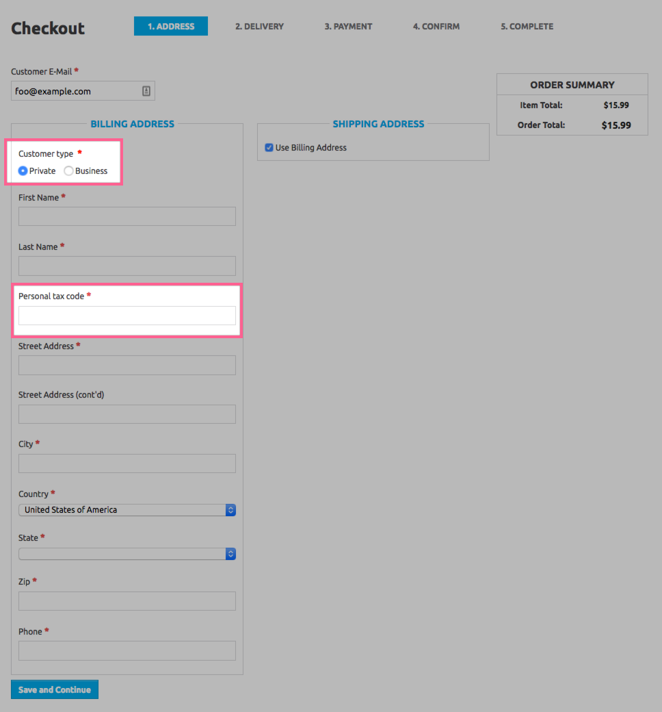
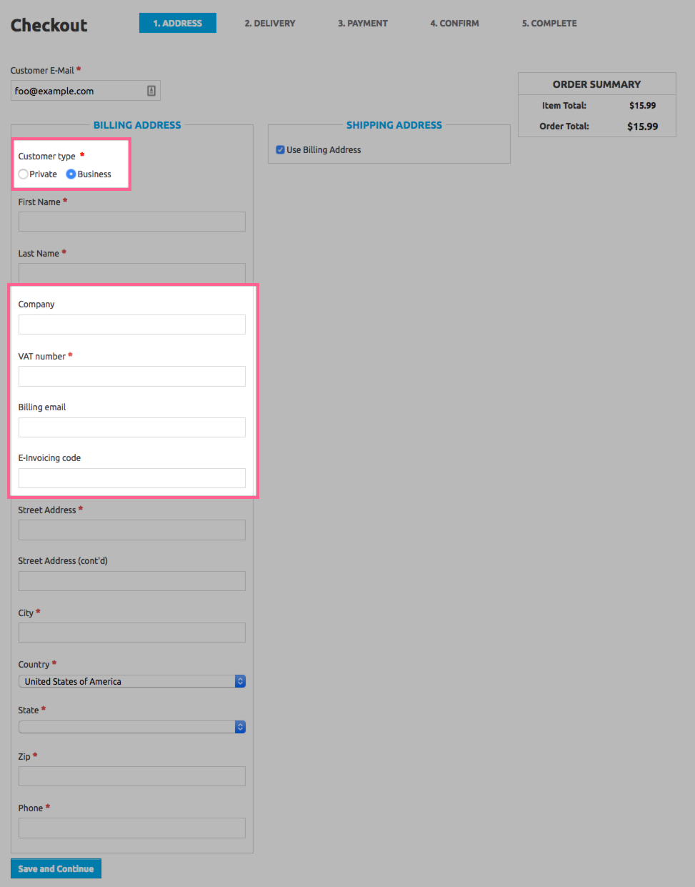
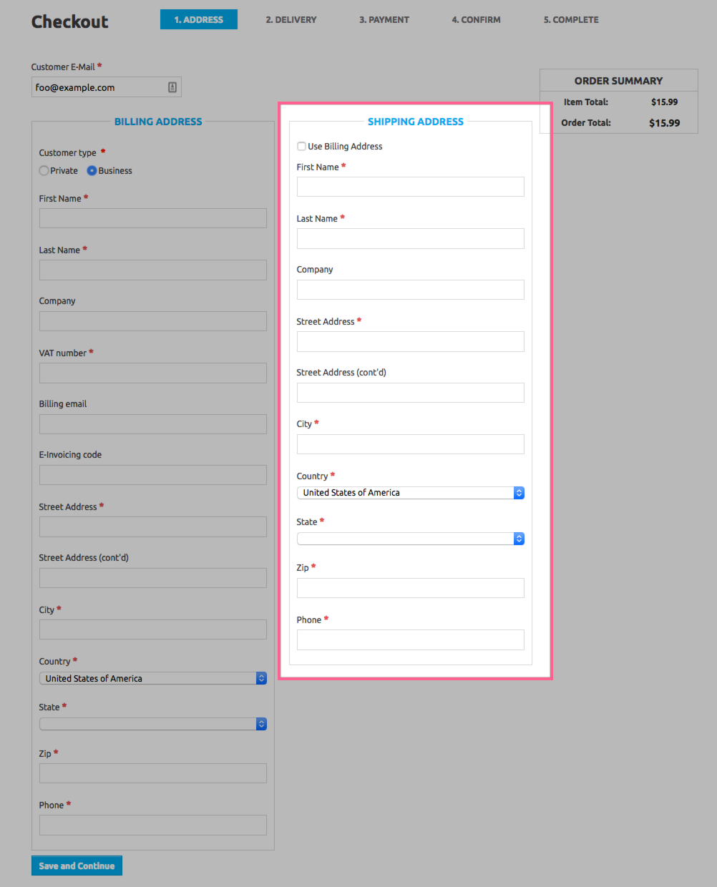

# Solidus Billing Address

[](https://travis-ci.org/welaika/solidus_billing_address)

Manage italian billing address requirements in Solidus! Mamma mia!

This extension adds some new attributes to billing address form in `solidus_frontend`, like:

* VAT number
* Personal tax code (e.g. "Codice fiscale" in Italy)
* Billing email (e.g. "PEC Address" in Italy)
* Electroning invoicing code (e.g. "Codice destinatario fatturazione elettronica" in Italy)

It also validates the presence of customer last name.

## Demo (frontend)

Billing address for a private customer



Billing address for a business customer



Shipping address (no need for billing only attributes)



## Installation

Add solidus_billing_address to your Gemfile:

```ruby
gem 'solidus_billing_address'
```

Bundle your dependencies and run the installation generator:

```shell
bundle
bundle exec rails g solidus_billing_address:install
```

Testing
-------

I usually test with PostgreSQL locally. For this to work, you need a role named `postgres`. If you don't have it, you can create a superuser role with

```shell
createuser -s postgres
```

Bundle your dependencies, then run `rake`. `rake` will default to building the dummy app if it does not exist, then it will run specs, and [Rubocop](https://github.com/bbatsov/rubocop) static code analysis. The dummy app can be regenerated by using `rake test_app`.

```shell
bundle
DB=postgres bundle exec rake
```

You can also test against a specific solidus branch with:

```shell
SOLIDUS_BRANCH=v2.9 DB=postgres bundle exec rake
```

When testing your application's integration with this extension you may use its factories.
Simply add this require statement to your spec_helper:

```ruby
require 'solidus_billing_address/factories'
```

## Releasing

Your new extension version can be released using `gem-release` like this:

```shell
bundle exec gem bump -v VERSION --tag --push --remote upstream && gem release
```

## Author

made with ❤️ and ☕️ by [weLaika](https://dev.welaika.com)

## License

Copyright (c) 2019 [weLaika](https://dev.welaika.com), released under the New BSD License
